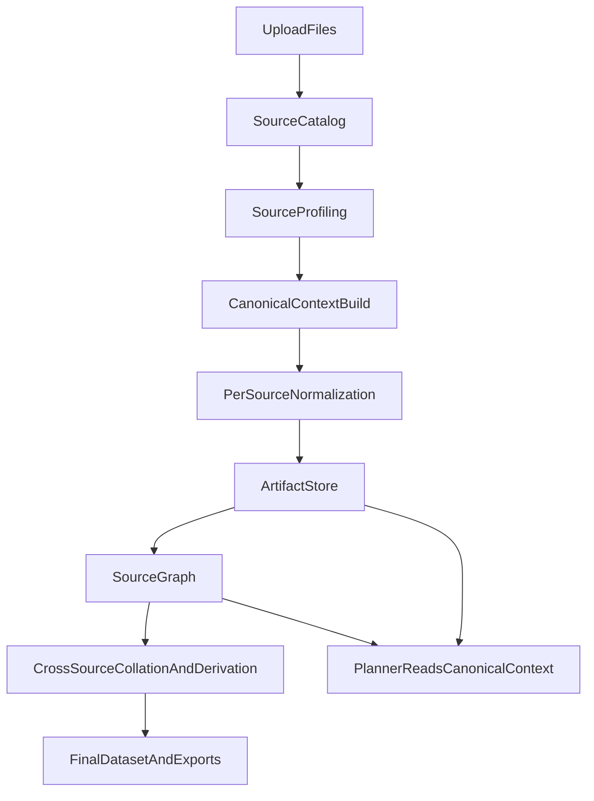

# Schema Agent: Technical Architecture & Data Flow

This document describes the actual, implemented architecture of the Schema Agent system together with the target architecture the repository is migrating toward. It is intentionally specific about where the current implementation diverges from the canonical model so that refactors can be scoped accurately.

## 1. System Overview

The Schema Agent ingests messy, hierarchical spreadsheets and produces normalized, flat datasets. It is built around three complementary layers:

- **Orchestration** via LangGraph (`sia/agent/graph.py`, `sia/agent/orchestrator.py`)
- **Reasoning** via LLM-backed cognitive nodes (`sia/agent/nodes.py`, `planner.py`, `verifier.py`, `judge.py`)
- **Execution** via a pure Python transformation library exposed through MCP (`sia/tools/transformation_tools.py`, `sia/mcp_server.py`)

The system is **source-at-a-time** by design: one file/sheet combination is processed per LangGraph run. Multiple sources are orchestrated outside the graph and combined through relationship-aware collation.

### Core Technologies
- **Orchestrator**: LangGraph (StateGraph)
- **State Management**: Python `TypedDict` with `Annotated` reducers
- **Data Engine**: Pandas, NumPy, OpenPyXL
- **Tool Protocol**: Model Context Protocol (MCP) via FastMCP
- **Persistence**: File uploads in `runtime/uploads`, outputs in `runtime/outputs`, and a planned durable metadata layer in `sia/storage/` (see Section 7)

---

## 2. End-to-End Data Flow

For the **multi-layer job model** (web job layer vs per-source LangGraph vs collation vs post-collate), see [ORCHESTRATION.md](./ORCHESTRATION.md).



The path from upload to final output has two compute stages:

1. **Per-source normalization** runs the LangGraph pipeline against one `source_id` at a time. It loads a scoped grid, resolves mappings, generates a plan, executes transformation tools, and verifies the output. This produces a normalized dataframe and a set of context artifacts for that source.
   - When the job is a **multi-source batch** (`multi_source_active_batch` on state), grain-changing tools (`transform.aggregate_weekly`, daily expansion tools, etc.) are **deferred** until after collation **`duplicate_check`** and merge resolution on the stacked frame. In that mode the **output verifier** and **replanner** do not enforce the template weekly grain on each source; weekly checks apply after the combined frame is built (rollup in `post_collate_transforms` / deferred tool replay).
   - **Grouped rows → flat + metric semantics (Expand_Grouped_Rows_With_Metric_Semantics)**:
     `transform.allocate_block_metric` applies the split: **Option A — equal:** `row_metric = block_total / number_of_rows_in_block`;
     **Option B — weighted:** `row_metric = block_total * (row_weight / sum_weights_in_block)`, e.g. `weight_col` = impressions when delivery varies by post.
     Optionally run **`transform.infer_block_boundary_columns`** on columns that survive rename (when noisy ids such as Ref were dropped) to refresh plausible `block_start_columns`, then **`transform.classify_metric_level`** (same `block_start_columns` as allocation) for block-header vs post-row grain and suggested `equal` / `by_weight` parameters.
     When spend appears only on section header rows (post rows blank), plan `transform.allocate_block_metric`
     **after `rename`/`type_cast`** so `metric_col` exists (the pipeline’s stage sort enforces this ordering even if the LLM lists allocation first). Then `transform.aggregate_weekly` with explicit `metric_rules`; `transform.fill_merged` is for **dimensions** only, not for duplicating budget totals into every row before a `sum` rollup.
2. **Cross-source collation and derivation** combines already-normalized sources using approved relationship records. It supports union, lookup/reference enrichment, explicit joins, derived fields that reference upstream source columns, and source-to-source validations.

---

## 3. Per-Source Processing Layers

### A. Orchestration Layer (LangGraph)
- **State (`AgentState`)**: A `TypedDict` in `sia/agent/state.py` that carries `current_df`, the active grid, extraction plans, HITL flags, confidence trajectory, and tool history.
- **Feedback Loops**: Non-linear routing supports replan after verification failure and rollback to `last_valid_checkpoint` when confidence regresses.

### B. Reasoning Layer (Cognitive Nodes)
Each node in `sia/agent/nodes.py` is a specialized wrapper around domain logic and LLM calls:
1. **`load_file_node`** - loads workbook via `sia/modules/visual_normalizer.py` and attaches the scoped grid.
2. **`analyze_structure_node`** - produces a structural report and column analysis.
3. **`resolve_mapping_node`** - normalizes approved mappings and applies them to the dataframe.
4. **`infer_relationships_node`** (legacy helper) — same logic as optional tool ``discovery.propose_file_relationships`` inside ``execute_tools``; the **LangGraph** no longer includes a mandatory ``infer_relationships`` node.
5. **`generate_plan_node`** — produces a sequence of tool calls using `PlanGenerator` in `planner.py`.
6. **`execute_tools_node`** — runs MCP-backed transformation tools, local `collation.*` tools, and optional **``discovery.propose_file_relationships``** (multi-source proposals) on the active frame / context.
7. **`verify_output_node`** — validates flatness; **weekly template grain** is enforced here only for **single-source** runs or join-style multi-source paths. For **union batches with deferred weekly rollup**, grain checks are skipped at this node and applied on the combined output after collation.
8. **`finalize_node`** — emits the final schema and judge summary.

### C. Execution Layer
- **`sia/tools/transformation_tools.py`** implements the pure Python transformation primitives.
- **`sia/mcp_server.py`** exposes those primitives to the LLM with JSON-safe serialization.

---

## 4. State Management

`AgentState` is a `TypedDict`. Key fields relevant to the architecture:

```python
class AgentState(TypedDict):
    current_df: Optional[pd.DataFrame]
    extraction_plan: Optional[ExtractionPlan]
    context_packet: Optional[Dict[str, Any]]
    source_metadata: Optional[Dict[str, Any]]
    approved_mappings: List[Dict[str, Any]]
    business_rules: List[Dict[str, Any]]
    approved_relationships: List[Dict[str, Any]]
    tools_history: Annotated[List[ToolExecutionRecord], operator.add]
    issues_history: Annotated[List[IssueRecord], operator.add]
    confidence_trajectory: Annotated[List[float], operator.add]
    requires_review: bool
    hitl_pending_approval: bool
```

- **Annotated reducers** (`operator.add`) make histories cumulative.
- **Confidence trajectory** drives rollback when a step regresses.

---

## 5. Context Architecture

Context is divided into two layers:

### Persisted context (on the job object)
- `source_registry` - one entry per (file, sheet) known as a `source_id`
- `source_scope_registry` - approved scope/layout per source
- `layout_registry` - classified main and context blocks per source
- `mapping_registry` - approved source-to-target column mappings
- `business_rules_registry` - deterministic rules per source
- `approved_file_relationships` - analyst-approved relationships across sources
- `user_notes` - free-form operator notes

### Derived canonical context
`sia/agent/context_packet.py` assembles a `ContextPacket` for one active source. It includes:

- source metadata and file lineage
- available sources and peer summaries
- approved scope and layout (main blocks, context blocks, header row)
- approved mappings and business rules
- target template and pre-transform columns
- user notes and unresolved items
- `context_block_snippets` extracted from approved context regions
- `interpreted_context` - typed fields (modeling period, publisher, market, brand, campaign, owner, granularity, aggregation logic) plus assumptions and evidence

`ContextPacket.planning_summary()` exposes a folded view used by the planner prompt.

### Known current divergences
- **Second planning summary**: `resolve_mapping_node` in `sia/agent/nodes.py` writes a narrower `planning_summary` into `context_packet` using `_summarize_mapping_state`, which omits `layout_summary`, `interpreted_context`, and `relationship_summary`. This causes the planner to sometimes miss interpreted context even when `ContextPacket.planning_summary()` had it.
- **Rebuilt-on-demand context artifacts**: `context_block_snippets` and `interpreted_context` are rebuilt by rereading the workbook every time a packet is built, instead of being persisted.
- **In-memory-only job state**: `JobManager` in `sia/agent/job_manager.py` holds all job state in process memory, so restarts lose jobs and HITL queues.
- **Descriptive, not executable, relationships**: `relationships.collate_frames` ignores approved `join_keys` in favor of a fixed heuristic column set in `_join_frames`.
- **No cross-source planning context**: The planner prompt in `sia/agent/planner.py` does not receive upstream source columns, relationship topology, or derived-field capabilities.

---

## 6. Canonical Context Model (Target)

The canonical context is a single, source-scoped object with these sections. It is produced by `sia/agent/context_packet.py` via `build_context_packet` and consumed by every downstream node.

- **`job`** - job identifiers and template reference
- **`active_source`** - `source_id`, file, sheet, fingerprint, scope metadata
- **`available_sources`** - peer source summaries, roles, and column inventories
- **`template_context`** - target template, `x_scope`, `pre_transform_target_columns`
- **`scope_context`** - approved layout: header row, analysis bounds, main blocks, context blocks
- **`mapping_context`** - approved mappings, excluded columns, unresolved target columns
- **`business_rule_context`** - normalized rule set keyed by target column
- **`interpreted_context`** - typed fields, assumptions, evidence
- **`relationship_context`** - relationship records with `relationship_kind`, directionality, join keys, cardinality hints, confidence
- **`artifact_context`** - paths/references to persisted source artifacts (raw snapshot, scoped df, prepared df, normalized df, context snippets, interpreted context, schema profile)
- **`planner_hints`** - folded view used by the planner prompt; derived only, never authoritative

**Rules:**
1. The `ContextPacket` is the only authoritative runtime context.
2. `planner_hints` is strictly a derived view; nodes must not create parallel summaries.
3. Nodes may enrich the canonical context but must not replace its structure.

See `sia/agent/context_packet.py::canonical_planning_view()` for the single derived view.

---

## 7. Durable Storage Layer (Target)

Persistence is introduced under `sia/storage/` with the following split:

### SQLite (metadata)
Tables keyed by `job_id` and `source_id`:

- `jobs` - job status, template path, timestamps
- `sources` - source registry entries
- `scopes` - scope and layout decisions
- `mappings` - approved mappings
- `business_rules` - deterministic rules
- `relationships` - approved relationships with executable join semantics
- `derived_fields` - cross-source derived field plans
- `artifacts` - artifact metadata and paths
- `hitl_checkpoints` - HITL review state for resume
- `user_notes` - operator notes

### Filesystem (artifacts)
Artifacts are written under `runtime/artifacts/<job_id>/<source_id>/<artifact>.<ext>` with:

- `raw_sheet_snapshot.parquet` - raw loaded dataframe
- `scoped_dataframe.parquet` - after scope/layout pruning
- `prepared_dataframe.parquet` - after mapping rename and rules
- `normalized_dataframe.parquet` - final per-source normalized output
- `context_block_snippets.json`
- `interpreted_context.json`
- `schema_profile.json`
- `trace_snapshot.json`

Artifact validity is tracked by a fingerprint derived from source file hash, approved scope, mappings, rules, and template version. When the fingerprint changes, the artifact is invalidated.

`JobManager` becomes a thin facade over these repositories and retains its existing API so callers do not change. The in-memory path remains as a fallback when persistence is disabled.

---

## 8. Source Graph and Executable Relationships (Target)

The current `relationships.py` treats relationships as descriptive metadata. The target model upgrades them into an executable graph:

- Each source is a node with `role` in `{fact, lookup, reference, dimension, parallel_main}`.
- Each relationship is an edge with:
  - `relationship_kind` in `{union, join, lookup}`
  - `join_keys` (authoritative at runtime)
  - `direction` (for lookups: source that receives enrichment)
  - `cardinality` (`1:1`, `1:many`, `many:1`, `many:many`)
  - `confidence`, `status`, `rationale`
- `SourceGraph` service builds this graph from persisted records and exposes:
  - `available_fields(source_id)` - normalized columns available for planner
  - `reachable_sources(source_id)` - sources connected through approved edges
  - `join_path(from_id, to_id)` - approved join path, if any
- `collate_frames` is rewritten to use `join_keys` from `RelationshipRecord` rather than heuristic column intersection.

---

## 9. Cross-Source Collation and Derivation (Target)

After all selected sources are normalized and persisted as artifacts, a dedicated stage runs the multi-source logic:

### Supported operations
- **Union** - stack parallel fact sources that share a schema
- **Lookup / reference** - enrich a fact source with columns from a lookup source
- **Join** - explicit join on approved keys
- **Derived fields** - create a new column in a target dataset using expressions that reference upstream source columns
- **Cross-source validations** - coverage, duplicates, key-missing checks

### Derived field grammar (constrained)
A `DerivedFieldPlan` contains:

- `target_source_id` - where the new column lands
- `target_column` - new column name
- `expression` - a small deterministic expression that references `source_id.column_name` tokens
- `join_context` - the approved join path used to pull upstream values
- `fallback` - optional default when the join yields no match
- `approved_by` - analyst attribution

The executor:
1. Validates that every referenced `source_id.column_name` exists on the corresponding normalized artifact.
2. Validates that the join path is approved through `SourceGraph`.
3. Materializes the new column against the target source artifact.
4. Writes a derivation trace for audit.

### Why this design fits the project
Analysts frequently need to reference a column in another workbook to produce a new derived column in the current sheet (for example, mapping a campaign code to a campaign group via a lookup file, or cross-referencing a market cluster from a separate dimension file). A post-hoc, schema-free concat is not enough; this stage makes these operations explicit, validated, and auditable.

---

## 10. Tooling Philosophy

### Lossless by default
All unpivot/melt primitives carry forward columns that are not explicitly transformed into value columns, preventing dimension loss.

### Physical anchoring
Rather than relying on the model to find columns by name, the analyzer provides grid coordinates so that same-name columns in different blocks cannot be confused.

### MCP integration
Tools are decoupled from the agent so the same primitives can be called by the web UI, the CLI, or external agents like Cursor.

---

## 11. Migration Phases

The repository migrates in six low-risk phases:

1. **Stabilize the contract** - this document, the canonical view helper in `context_packet.py`, and removing the `planning_summary` drift in `nodes.py`.
2. **Durable repositories** - introduce `sia/storage/` and back `JobManager` with a persistent layer while keeping its public API stable.
3. **Persisted artifacts** - store snippets, interpreted context, and normalized per-source dataframes with fingerprint-based invalidation.
4. **Executable relationships** - make approved `join_keys` the runtime merge contract and add the `SourceGraph` service.
5. **Split normalization from collation** - run per-source normalization through the existing LangGraph and a new cross-source stage against artifacts.
6. **Cross-source derived fields** - add the derived field grammar, validator, and executor behind a feature flag.
