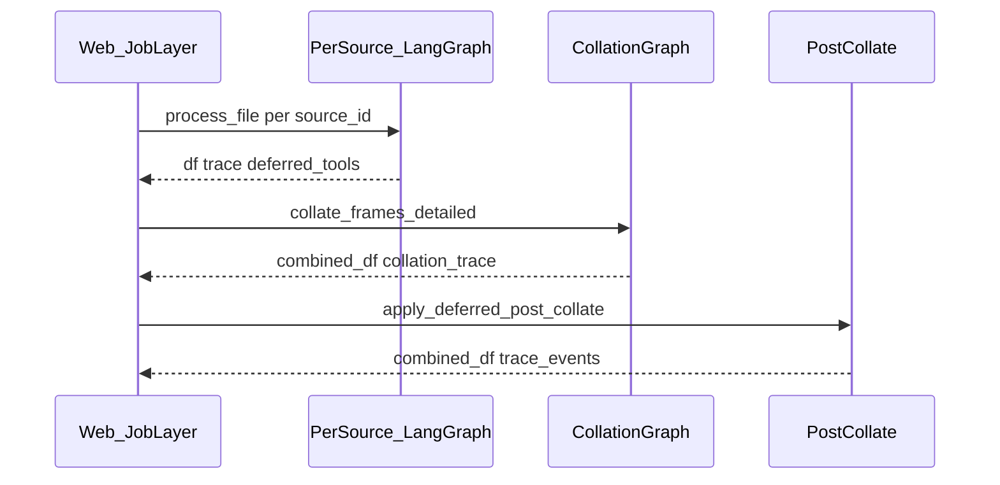

# Job orchestration (multi-layer model)

This document describes how **jobs** (possibly many uploaded workbooks and sheets) connect to **per-source LangGraph** runs, **collation**, and **post-collate** transforms. It complements the high-level flow in [ARCHITECTURE.md](./ARCHITECTURE.md) Section 2.

## Sequence (multi-source)

Optional HITL pause points exist inside `PerSource_LangGraph` (mapping, destructive tools, verifier, and file-relationship review when deferred to the web layer).

## Four layers

| Layer | Responsibility | Entry trigger | Key files | Persisted keys on `job` (examples) |
|-------|----------------|---------------|-----------|--------------------------------------|
| **Job layer** (web + `job_manager`) | Uploads, UX gates, registry, materialized clean workbooks, calling `process_file` per source, collation orchestration, exports | User starts processing or resumes HITL | `web_server.py`, `sia/agent/job_manager.py`, `sia/agent/materialized_clean_sheet.py` | `source_registry`, `data_files`, `approved_file_relationships`, `materialized_clean_templates`, `source_bootstrap`, `processing_route`, `source_execution_registry`, `_deferred_post_collate_by_source` |
| **Per-source LangGraph** | Load → structure → mapping → relationships → plan → tools → verify/replan for **one** `source_id` | `StructureInferenceAgent.process_file` | `sia/agent/graph.py`, `sia/agent/nodes.py` | Trace on `job["trace"]` / per-source runs; deferred tool lists on trace |
| **Parent collation graph** | Deterministic merge/dedupe on the **combined** frame after per-source runs | `collate_frames_detailed` / relationship-review resume paths | `sia/agent/parent_collation_graph.py`, `sia/agent/relationships.py` | Collation trace merged into job debug payloads |
| **Post-collate transforms** | Replay tools deferred until union grain is known | After collation when deferred tools were recorded | `web_server.py` (post-collate helpers), tool execution via `TransformationTools` / MCP | `_deferred_post_collate_by_source`, combined output |

## Bootstrap and routing (Phase 1)

Before the first `process_file` for a batch, the job layer may run **`bootstrap_job_sources`** (inventory + per-sheet inspect using effective paths from `resolve_processing_workbook`) and set **`route_processing_mode`** on `job["processing_route"]`. See `sia/agent/job_run_ledger.py`.

## Ledger helpers

Multi-source bookkeeping (registry of per-source runs and deferred post-collate tool lists) is centralized in **`sia/agent/job_run_ledger.py`** (`clear_multi_source_ledger`, `record_source_run_ledger`, summaries for the context packet).
